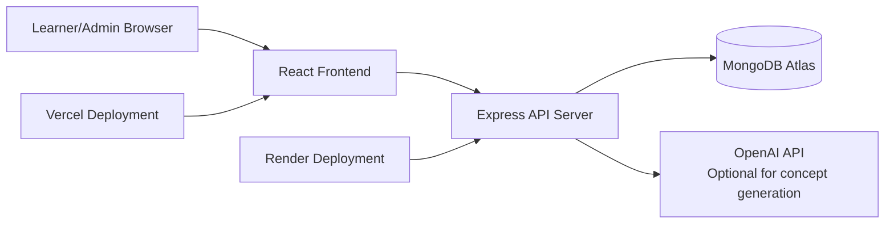
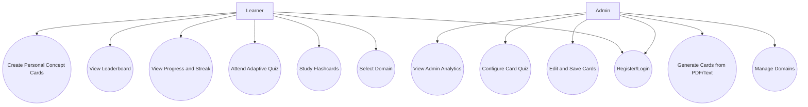
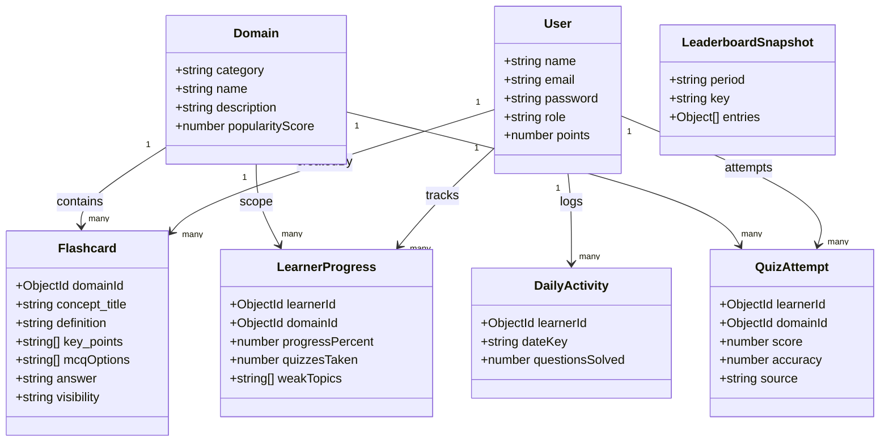
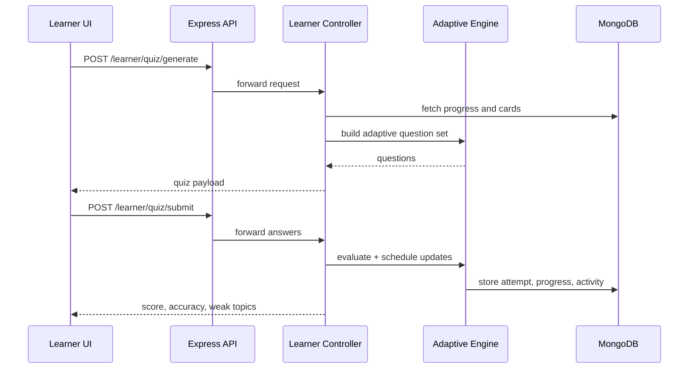
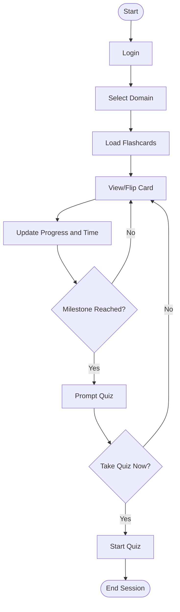
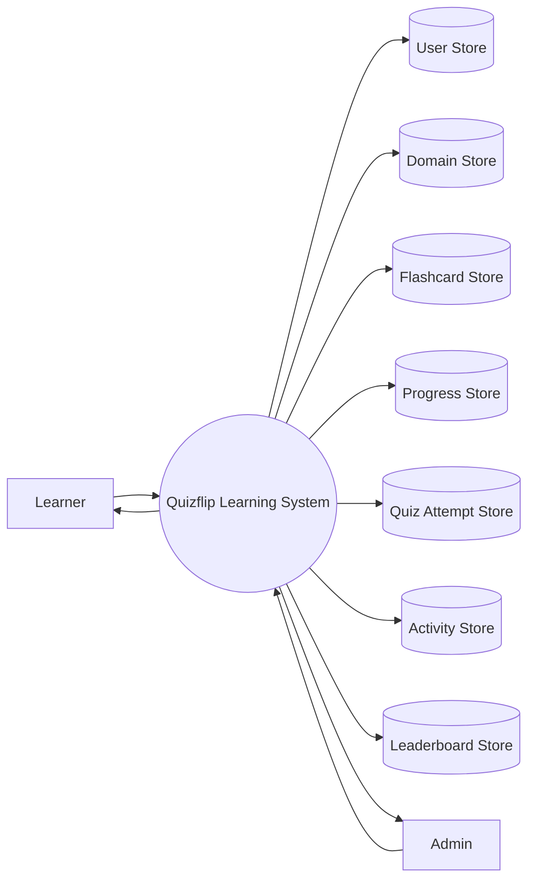
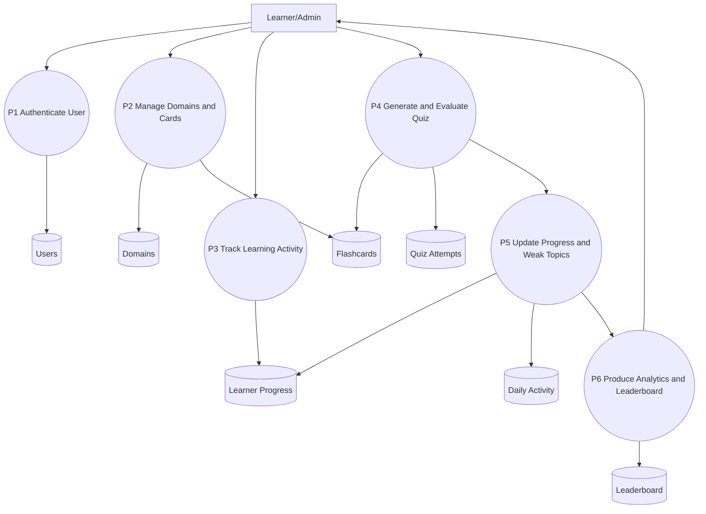
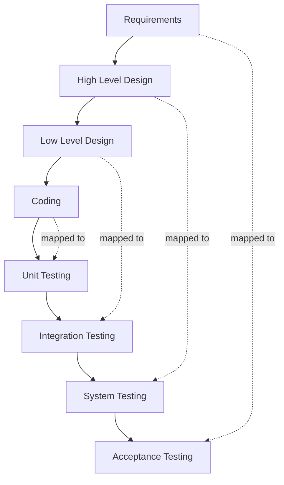

# Quizflip Diagram Pack (Mermaid)

Use these Mermaid blocks to generate diagram images for Chapter 5.

## Fig 5.1 High Level System Architecture

## Fig 5.2 Use Case Diagram

## Fig 5.3 Class Diagram

## Fig 5.4 Sequence Diagram - Learner Quiz Flow

## Fig 5.5 Activity Diagram - Flashcard Learning

## Fig 5.6 DFD Level 0

## Fig 5.7 DFD Level 1

## Fig 5.8 V Shaped SDLC Model

