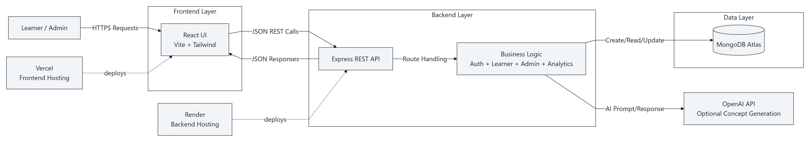
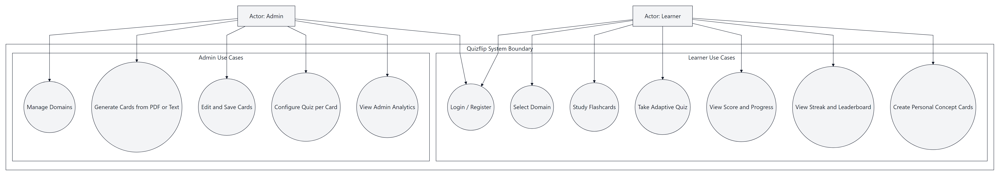
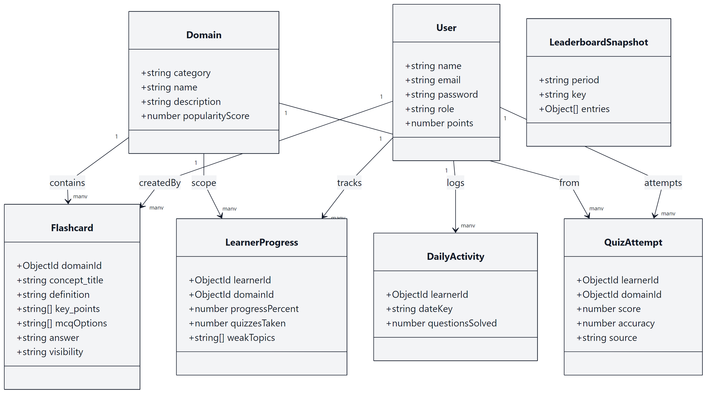
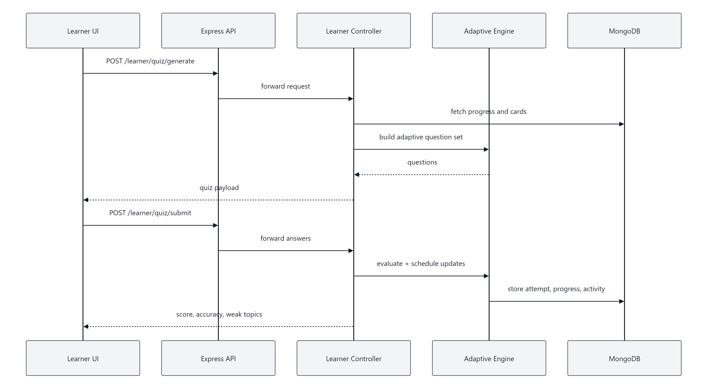
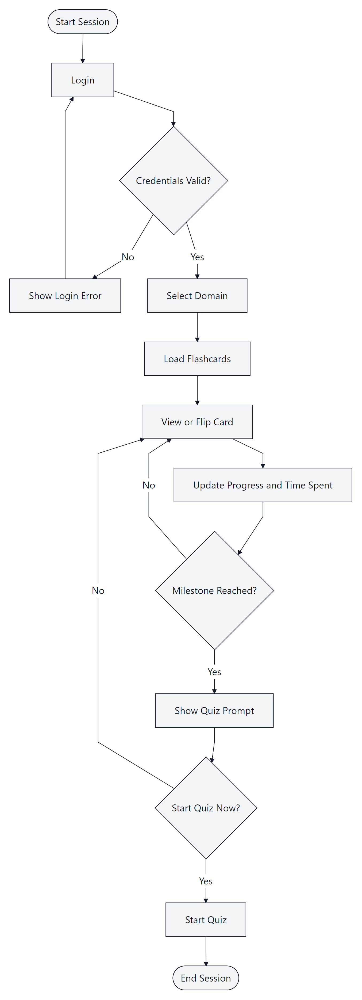
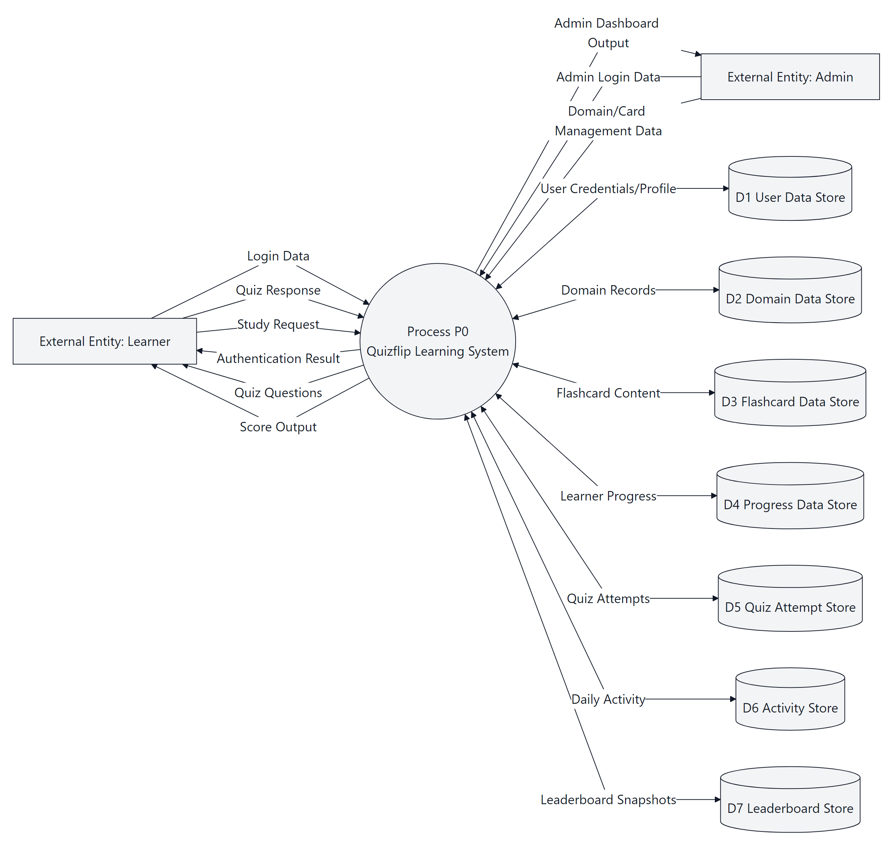
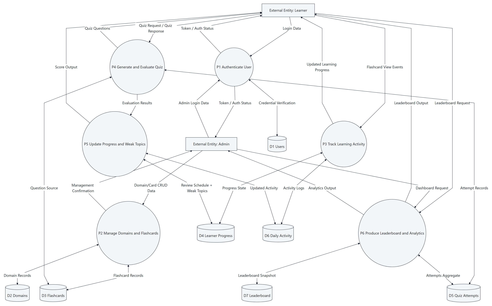
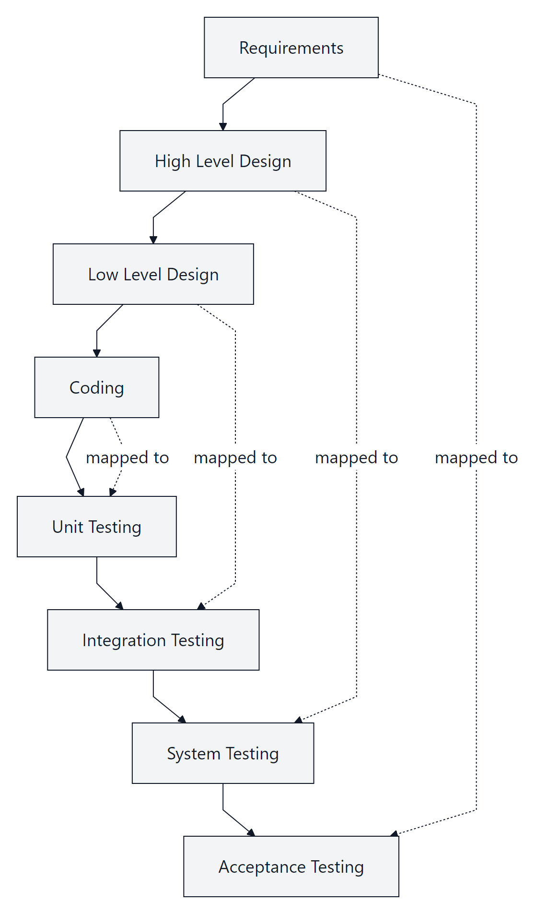

# QUIZFLIP REPORT (PRINT-READY VERSION)

This file is formatted for final Word conversion.

Formatting to apply in Word:
1. Font: Times New Roman, size 12 (body)
2. Line spacing: 1.5
3. Margins: Left 1.5 in, Right 1 in, Top 1 in, Bottom 1 in
4. Chapter page breaks: insert a real page break at each [PAGE BREAK] marker
5. Page numbers: start from Introduction chapter
6. Keep figure/table numbering chapter-wise

---
# QUIZFLIP
## Adaptive Learning Platform Using Flashcards, Quizzes, and Progress Analytics

Minor Project Report

Submitted in partial fulfillment of the requirements for the award of the degree of
Bachelor of Technology

Submitted by
1. G Mohan Prudvi (24211A7243)
2. B Bhaskar (24211A7213)
3. Vindhya Choudary (24211A7245, Team Leader)

Under the guidance of
Mr. P. Senthil

Department of Artificial Intelligence and Data Science
B V Raju Institute of Technology
Narsapur, Medak District, Telangana, India
April 2026

---

## CERTIFICATE

This is to certify that the minor project report entitled "QUIZFLIP - Adaptive Learning Platform Using Flashcards, Quizzes, and Progress Analytics" is a bonafide record of work carried out by:

1. G Mohan Prudvi (24211A7243)
2. B Bhaskar (24211A7213)
3. Vindhya Choudary (24211A7245, Team Leader)

in partial fulfillment of the requirements for the award of Bachelor of Technology degree during the academic year 2025-2026.

Guide Signature: __________________

Project Coordinator Signature: __________________

Head of Department Signature: __________________

Date: __________________

---

## ACKNOWLEDGEMENT

We would like to express our sincere gratitude to our project guide, project coordinator, and all faculty members of the department for their valuable suggestions and continuous support during the development of our minor project, Quizflip.

We are thankful to our institution for providing the required academic environment, infrastructure, and encouragement to complete this project successfully. We would also like to thank our friends and classmates for their feedback during testing and demonstrations.

Finally, we are deeply grateful to our parents and family members for their constant motivation and moral support throughout this project.

---

## ABSTRACT

Quizflip is a full stack adaptive learning platform developed to improve student revision quality through concept wise flashcards, confidence based quizzes, progress tracking, and gamified performance analytics. Traditional study methods often lack personalization and immediate feedback. Quizflip addresses this challenge by combining spaced repetition logic, weak topic identification, and interactive practice modes in a single system.

The platform is built using React and Tailwind CSS for the frontend, Node.js and Express for the backend, and MongoDB for persistent data storage. The system supports role based access for learners and administrators. Learners can select domains, study flashcards, attend adaptive quizzes, monitor weak topics, and maintain study streaks. Administrators can manage domains, upload or generate concept cards from PDF or text, configure quiz content, and monitor learning analytics.

The project demonstrates practical software engineering through modular architecture, secure authentication, REST API design, and deployment readiness. The final system is scalable, user friendly, and suitable for educational environments where regular revision and measurable learning outcomes are essential.

Keywords: Adaptive Learning, Flashcards, Spaced Repetition, Quiz Analytics, Full Stack Development, EdTech.

---

## TABLE OF CONTENTS

1. INTRODUCTION  
1.1 Background and Motivation  
1.2 Problem Statement  
1.3 Objectives  
1.4 Scope of the Project  
1.5 Existing System  
1.6 Limitations of Existing System  
1.7 Organization of Report  

2. LITERATURE SURVEY  
2.1 Digital Learning Platforms  
2.2 Spaced Repetition and Retention Theory  
2.3 Adaptive Quiz Systems  
2.4 Gamification in Learning  
2.5 Research Gap  

3. PROPOSED SYSTEM  
3.1 System Overview  
3.2 Features of Proposed System  
3.3 Advantages of Proposed System  
3.4 Module Interaction  

4. REQUIREMENT ANALYSIS  
4.1 Feasibility Study  
4.2 Functional Requirements  
4.3 Non Functional Requirements  
4.4 Software and Hardware Requirements  

5. SYSTEM DESIGN  
5.1 Architecture Design  
5.2 Description of Modules  
5.3 Description of Algorithms  
5.4 UML Diagrams  
5.5 Data Flow Diagrams  
5.6 V Shaped SDLC Model  

6. CODING SPECIFICATIONS  
6.1 Installation of Required Libraries  
6.2 server.js (Entry Point)  
6.3 Code Snippets  
6.3.1 Initializes MongoDB Database and Bootstrap  
6.3.2 Authentication and Authorization  
6.3.3 Index and Root API  
6.3.4 Register  
6.3.5 Login and Logout  
6.3.6 Dashboard and Domain Start  
6.3.7 Flashcard Learning  
6.3.8 Quiz Generation and Submission  
6.3.9 Progress Analytics  
6.3.10 Streak and Leaderboard  
6.3.11 Admin Concept Card Generation and Save  

7. TESTING  
7.1 Testing Strategy  
7.2 Types of Testing Performed  
7.3 Test Cases and Results  
7.4 Defects and Fixes  

8. FUTURE ENHANCEMENT  

9. CONCLUSION  

10. REFERENCES  

11. APPENDIX  

---

## LIST OF TABLES

Table 4.1 Functional Requirements  
Table 4.2 Non Functional Requirements  
Table 4.3 Software and Hardware Requirements  
Table 5.1 Module Description Summary  
Table 7.1 Sample Test Cases and Expected Results  
Table 7.2 Bug Fix Summary  
Table 11.1 API Endpoint Summary  

---

## LIST OF FIGURES

Fig 5.1 High Level System Architecture  
Fig 5.2 Use Case Diagram  
Fig 5.3 Class Diagram  
Fig 5.4 Sequence Diagram - Learner Quiz Flow  
Fig 5.5 Activity Diagram - Flashcard Learning Flow  
Fig 5.6 DFD Level 0  
Fig 5.7 DFD Level 1  
Fig 5.8 V Shaped SDLC Model  
Fig 6.1 Landing Page  
Fig 6.2 Authentication Page  
Fig 6.3 Domain Selection Page  
Fig 6.4 Flashcard Learning Interface  
Fig 6.5 Quiz Page  
Fig 6.6 Progress Dashboard  
Fig 6.7 Streak Calendar  
Fig 6.8 Leaderboard Page  
Fig 6.9 Admin Dashboard  

---

---

[PAGE BREAK]

## CHAPTER 1
# INTRODUCTION

### 1.1 Background and Motivation

Digital education platforms are becoming essential for modern students. However, many learners still face difficulty in remembering concepts for long durations. Traditional note reading and one time practice often produce short term understanding but weak long term retention. This issue becomes more visible in technical education where students need repeated revision and topic wise confidence.

Quizflip is developed as a practical solution for this challenge. It combines flashcard based learning, adaptive quizzes, confidence tracking, and progress analytics in one platform. The project is designed to support both self learning students and administrators who manage learning content.

### 1.2 Problem Statement

Most student learning applications provide static content and fixed question sets. They do not adjust to learner performance, do not highlight weak topics effectively, and do not provide motivational features like streak tracking and competitive ranking.

The problem addressed in this project is:

How to design and implement a web based learning platform that provides adaptive revision, tracks user progress continuously, and improves concept retention through personalized practice.

### 1.3 Objectives

The major objectives of Quizflip are as follows:

1. To build a role based learning platform with separate learner and admin workflows.
2. To provide domain wise concept learning using flashcards.
3. To generate quizzes adaptively based on learner confidence and previous mistakes.
4. To detect weak topics and offer targeted practice modes.
5. To provide progress insights such as accuracy, completion, and time spent.
6. To maintain daily consistency using streak calendar visualization.
7. To include leaderboard based gamification for motivation.
8. To support content generation from PDF and text inputs for admin users.

### 1.4 Scope of the Project

The scope of Quizflip includes:

1. User registration and login with secure authentication.
2. Domain selection across science, technical, and language topics.
3. Flashcard based concept learning with interactive interface.
4. Adaptive quiz generation with MCQ and fill blank question types.
5. Confidence based spaced repetition flow.
6. Progress and streak analytics.
7. Admin tools for content management and analytics dashboard.
8. Deployment ready architecture for cloud hosting.

The project does not currently include video lectures, real time classroom sessions, or native mobile applications.

### 1.5 Existing System

In many existing systems, students revise concepts through static notes, random question banks, or simple flashcard apps. These systems usually provide identical content to every learner without measuring performance deeply.

Existing systems commonly have the following characteristics:

1. No confidence aware revision planning.
2. No weak topic prioritization.
3. Limited analytics for learner and admin.
4. Minimal role based content governance.
5. Less engaging interfaces for long term usage.

### 1.6 Limitations of Existing System

1. Personalized revision is not available in most basic learning tools.
2. Learners do not receive topic wise performance feedback.
3. Admins cannot easily generate high quality cards from documents.
4. Manual practice methods consume more time and reduce consistency.
5. Lack of gamification leads to low daily engagement.

### 1.7 Organization of Report

This report is organized into multiple chapters. Chapter 1 introduces the problem and objectives. Chapter 2 discusses related literature. Chapter 3 explains the proposed system. Chapter 4 contains requirement analysis. Chapter 5 covers architecture and design. Chapter 6 explains implementation details. Chapter 7 presents testing strategy and results. Final chapters discuss future scope, conclusion, references, and appendices.

---

---

[PAGE BREAK]

## CHAPTER 2
# LITERATURE SURVEY

### 2.1 Digital Learning Platforms

Digital learning platforms have transformed traditional educational models by introducing anytime and anywhere access. Most platforms focus on content delivery and assessment but vary greatly in adaptation capability. Research indicates that platforms with interactive practice and feedback loops produce better outcomes than passive content systems.

Common digital learning categories include:

1. Video lecture based systems.
2. LMS based institutional platforms.
3. Quiz and assessment engines.
4. Flashcard oriented revision tools.

Quizflip belongs to the fourth category with additional adaptive intelligence features.

### 2.2 Spaced Repetition and Retention Theory

The forgetting curve concept highlights that learners forget information quickly without repeated recall. Spaced repetition improves long term memory by presenting information at increasing intervals. This model has been adopted by several language and exam preparation platforms.

In this project, spaced repetition is implemented with practical confidence tiers:

1. Hard confidence: card appears again soon.
2. Medium confidence: card appears after a moderate gap.
3. Easy confidence: card appears after a longer interval.

This approach helps learners spend more time on difficult concepts.

### 2.3 Adaptive Quiz Systems

Adaptive systems adjust question difficulty based on user performance. Instead of fixed tests, they focus on learning outcomes by identifying weak zones. Research in adaptive testing confirms improved engagement and better concept mastery when quizzes align with learner ability.

Quizflip uses adaptive quiz generation by combining:

1. Previous answer correctness.
2. Confidence level provided by learner.
3. Weak topic history.
4. Practice mode selection such as hard, medium, easy, and weak topics.

### 2.4 Gamification in Learning

Gamification integrates game elements into educational platforms. Leaderboards, streaks, points, and milestones can increase motivation and reduce dropout behavior. Effective gamification should support learning goals instead of only competition.

Quizflip includes practical gamification:

1. Score based points system.
2. Daily study streak tracking.
3. Leaderboard ranking.
4. Visual progress indicators.

These features encourage regular usage and healthy competition.

### 2.5 Research Gap

From the literature study, many tools handle either flashcards, quizzes, or analytics separately. Very few student projects combine all in a single full stack system with admin content pipeline and adaptive logic.

The key gap addressed by Quizflip is integration of:

1. Adaptive revision engine.
2. Concept card generation workflow.
3. Role based administration.
4. Practical analytics for students and supervisors.

---

---

[PAGE BREAK]

## CHAPTER 3
# PROPOSED SYSTEM

### 3.1 System Overview

Quizflip is designed as a modular web application with separate frontend and backend layers connected through REST APIs. The frontend provides responsive interfaces for learner and admin roles. The backend handles business logic, authentication, adaptive engine operations, and database communication.

The system is built with the following architecture:

1. Presentation Layer: React based UI pages and reusable components.
2. Application Layer: Express controllers and service modules.
3. Data Layer: MongoDB collections managed through Mongoose schemas.
4. Security Layer: JWT authentication, role authorization, and route protection.

### 3.2 Features of Proposed System

#### 3.2.1 Learner Features

1. User registration and login.
2. Domain selection and personalized learning start.
3. Flashcard viewing with progress tracking.
4. Quiz generation in adaptive and practice modes.
5. Quiz submission with confidence feedback.
6. Performance dashboard showing completion, accuracy, and weak topics.
7. Streak calendar and leaderboard visibility.
8. Personal concept card creation and editing.

#### 3.2.2 Admin Features

1. Domain creation, update, and deletion.
2. Default flashcard seeding.
3. Concept card generation from PDF upload.
4. Concept card generation from raw text notes.
5. Manual editing and saving of generated cards.
6. Quiz authoring for concept cards.
7. Analytics dashboard for usage and outcomes.

### 3.3 Advantages of Proposed System

1. Personalized revision flow instead of static content order.
2. Better retention through confidence guided spaced repetition.
3. Fast content creation pipeline for educators.
4. Interactive and modern user interface.
5. Domain level scalability for multiple subjects.
6. Suitable for both academic and self study use cases.

### 3.4 Module Interaction

The modules interact in a controlled sequence:

1. Authentication module validates identity and role.
2. Domain module provides available learning tracks.
3. Learner module records study events and generates quizzes.
4. Adaptive engine recalculates due cards and weak topics.
5. Analytics module aggregates scores and rankings.
6. Admin module updates content and supervises platform quality.

The modular design improves maintainability and supports future extensions such as mobile clients and AI tutor assistance.

### 3.5 Assumptions and Constraints

Project assumptions:

1. Users have stable internet connection for cloud APIs.
2. Admin users upload educationally valid source content.
3. Learners provide honest confidence inputs during quiz submission.
4. MongoDB service remains available throughout active sessions.

Project constraints:

1. Minor project timeline limits advanced features such as full automation tests.
2. Free cloud tiers impose usage and rate limits.
3. PDF extraction quality depends on input document formatting.
4. Current system is optimized for web platform only.

### 3.6 Proposed System Workflow

1. Learner authenticates and selects a domain.
2. System initializes learner progress if first attempt.
3. Learner studies flashcards and progress is updated.
4. On milestone or practice request, adaptive quiz is generated.
5. Learner submits answers and confidence levels.
6. System computes score, weak topics, and review schedule.
7. Analytics pages reflect updated progress, streak, and leaderboard.

Admin workflow:

1. Admin logs in and manages domains.
2. Admin uploads PDF or text to generate concept cards.
3. Admin edits generated cards and saves final content.
4. Admin configures authored quiz settings for concept cards.
5. Admin monitors dashboard trends.

---

---

[PAGE BREAK]

## CHAPTER 4
# REQUIREMENT ANALYSIS

### 4.1 Feasibility Study

#### 4.1.1 Technical Feasibility

The project is technically feasible because the selected stack is lightweight, open source, and well documented. React, Node.js, and MongoDB support rapid development and deployment. The team has working knowledge of JavaScript and REST based application design.

#### 4.1.2 Economic Feasibility

The project has low development cost. Major tools are free for student use. Hosting on starter tiers of cloud services is affordable. Therefore, the system is economically feasible for academic deployment.

#### 4.1.3 Operational Feasibility

The platform is easy to use for students and administrators. The user interface follows common navigation patterns. Admin workflows reduce manual effort in content preparation. Hence, operational feasibility is high.

#### 4.1.4 Schedule Feasibility

The project was completed in minor project duration by dividing tasks across team members, with iterative testing and integration. The timeline is realistic for future enhancements as well.

### 4.2 Functional Requirements

Table 4.1 Functional Requirements

1. FR1: User registration and login.
2. FR2: Role based route access for learner and admin.
3. FR3: Domain listing and selection.
4. FR4: Flashcard view event tracking.
5. FR5: Adaptive quiz generation.
6. FR6: Quiz submission and score calculation.
7. FR7: Weak topic detection and storage.
8. FR8: Progress dashboard display.
9. FR9: Streak calendar generation.
10. FR10: Leaderboard generation.
11. FR11: Admin domain management.
12. FR12: PDF and text based concept card generation.
13. FR13: Concept card quiz authoring.

### 4.3 Non Functional Requirements

Table 4.2 Non Functional Requirements

1. Security: JWT token based authentication, password hashing.
2. Usability: Intuitive layout with clear navigation.
3. Performance: Fast API response under normal academic load.
4. Scalability: Support additional domains and learner records.
5. Reliability: Proper error handling and input validation.
6. Maintainability: Modular project structure and reusable components.
7. Portability: Runs on local systems and cloud servers.

### 4.4 Software and Hardware Requirements

Table 4.3 Software and Hardware Requirements

Software Requirements:

1. Operating System: Windows 10 or later.
2. IDE: Visual Studio Code.
3. Runtime: Node.js 16 or above.
4. Package Manager: npm.
5. Database: MongoDB Atlas or local MongoDB.
6. Browser: Chrome, Edge, or Firefox.

Hardware Requirements:

1. Processor: Dual core or above.
2. RAM: Minimum 4 GB, recommended 8 GB.
3. Storage: 2 GB free space.
4. Internet: Required for cloud database and deployment services.

### 4.5 User Stories

Learner stories:

1. As a learner, I want to choose a domain so that I can focus on one subject at a time.
2. As a learner, I want adaptive quizzes so that difficult concepts appear more frequently.
3. As a learner, I want weak topic insights so that I can improve faster.
4. As a learner, I want streak tracking so that I stay consistent daily.

Admin stories:

1. As an admin, I want to create and update domains so that curriculum stays organized.
2. As an admin, I want to generate concept cards from PDF and text so that content preparation time is reduced.
3. As an admin, I want to configure quiz questions per card so that evaluation quality improves.
4. As an admin, I want analytics dashboard access so that learner engagement can be monitored.

### 4.6 Requirement Traceability Summary

1. Objective O1 (secure access) maps to FR1, FR2 and security NFR.
2. Objective O2 (adaptive learning) maps to FR4, FR5, FR6, FR7.
3. Objective O3 (analytics) maps to FR8, FR9, FR10.
4. Objective O4 (admin content management) maps to FR11, FR12, FR13.
5. Objective O5 (scalability and maintainability) maps to modular architecture NFR.

---

---

[PAGE BREAK]

## CHAPTER 5
# SYSTEM DESIGN

### 5.1 Architecture Design

Quizflip follows a client server model.

1. Frontend client handles user interaction and page rendering.
2. Backend API layer processes requests and business rules.
3. Database layer stores users, domains, flashcards, progress, and attempts.
4. Optional AI integration assists in concept card generation.

Fig 5.1 should present this architecture with directional arrows among components.

**Fig 5.1 High Level System Architecture**

	

### 5.2 Description of Modules

Table 5.1 Module Description Summary

1. Authentication Module
- Handles registration, login, token verification, and role validation.

2. Domain Module
- Manages learning categories and domain specific content.

3. Learner Module
- Records flashcard usage, generates adaptive quizzes, and stores learner performance.

4. Admin Module
- Provides domain CRUD, concept card generation, and quiz authoring controls.

5. Analytics Module
- Calculates leaderboard and aggregates dashboard indicators.

6. Concept Card Editor Module
- Supports visual composition using text, shapes, images, and arrows.

### 5.3 Description of Algorithms

#### 5.3.1 Adaptive Question Selection

Algorithm Steps:

1. Read learner progress for selected domain.
2. Fetch due cards based on review schedule.
3. If due cards are less, fill from weak topic cards.
4. Build 15 quiz questions using card data.
5. Return structured question payload with options and answer model.

#### 5.3.2 Confidence Based Repetition Logic

1. If learner marks confidence Hard, schedule card for next quiz.
2. If confidence Medium, delay card by one cycle.
3. If confidence Easy, delay card by longer interval.
4. Update card review state counters.

#### 5.3.3 Weak Topic Scoring

1. Parse quiz submission answers.
2. Count incorrect answers per topic.
3. Rank topics by error frequency.
4. Save top weak topics in learner profile.

#### 5.3.4 Streak Calculation

1. Read daily activity records sorted by date.
2. Increment streak when consecutive day exists.
3. Reset current streak when day gap is greater than one.
4. Track longest streak value.

### 5.4 UML Diagrams

Include the following diagrams in this section:

1. Use Case Diagram showing learner and admin actors.
2. Class Diagram showing User, Domain, Flashcard, LearnerProgress, QuizAttempt entities.
3. Sequence Diagram for learner quiz workflow.
4. Activity Diagram for flashcard learning and quiz transition.

#### 5.4.1 Use Case Diagram Description

Actors:

1. Learner
2. Admin

Learner Use Cases:

1. Register and login.
2. Select domain.
3. View flashcards.
4. Attend adaptive quiz.
5. Submit answers with confidence.
6. View progress dashboard.
7. View streak and leaderboard.
8. Create and manage personal concept cards.

Admin Use Cases:

1. Login as admin.
2. Create, update, and delete domains.
3. Seed default flashcards.
4. Upload PDF and generate concept cards.
5. Generate cards from text input.
6. Edit and save generated cards.
7. Configure quiz per concept card.
8. View analytics dashboard.

**Fig 5.2 Use Case Diagram**

	

#### 5.4.2 Class Diagram Description

Core Classes and Relationships:

1. User
- Attributes: name, email, password, role, points.
- Relationship: one user can create many flashcards.

2. Domain
- Attributes: category, name, description, popularityScore.
- Relationship: one domain has many flashcards and learner progress records.

3. Flashcard
- Attributes: concept_title, definition, key_points, answer, mcqOptions, visibility.
- Relationship: belongs to one domain and one creator.

4. LearnerProgress
- Attributes: progressPercent, quizzesTaken, weakTopics, reviewStates.
- Relationship: belongs to one learner and one domain.

5. QuizAttempt
- Attributes: score, accuracy, source, answers.
- Relationship: belongs to one learner and one domain.

6. DailyActivity
- Attributes: dateKey, questionsSolved.
- Relationship: belongs to one learner.

7. LeaderboardSnapshot
- Attributes: period, key, entries.
- Relationship: stores ranking snapshots referencing users and domains.

**Fig 5.3 Class Diagram**

	

#### 5.4.3 Sequence Diagram - Learner Quiz Flow

Participants:

1. Learner UI
2. API Gateway (Express routes)
3. Learner Controller
4. Adaptive Engine Service
5. MongoDB

Flow:

1. Learner requests quiz generation.
2. Controller loads learner progress and flashcards.
3. Adaptive engine selects due cards and builds questions.
4. Questions returned to UI.
5. Learner submits answers with confidence.
6. Controller calculates score and updates progress.
7. Adaptive engine updates review schedule and weak topics.
8. MongoDB saves quiz attempt and activity.
9. Final performance response returned to UI.

**Fig 5.4 Sequence Diagram - Learner Quiz Flow**

	

#### 5.4.4 Activity Diagram - Flashcard Learning

1. Start learning session.
2. Select domain.
3. Load flashcards.
4. View card and optionally flip.
5. Mark next card.
6. Update progress and time spent.
7. Check milestone reached or not.
8. If milestone reached, show quiz prompt.
9. Continue learning or start quiz.
10. End session.

**Fig 5.5 Activity Diagram - Flashcard Learning**

	

### 5.5 Data Flow Diagrams

1. DFD Level 0: Overall interaction among learner, admin, and system.
2. DFD Level 1: Detailed process flow for authentication, learning, quiz handling, and analytics update.

#### 5.5.1 DFD Level 0 Description

External Entities:

1. Learner
2. Admin

Main Process:

1. Quizflip Learning System

Data Stores:

1. User Store
2. Domain Store
3. Flashcard Store
4. Progress Store
5. Quiz Attempt Store
6. Activity Store
7. Leaderboard Store

Data Flows:

1. Learner sends authentication and learning requests.
2. System returns flashcards, quizzes, and analytics.
3. Admin sends content management and generation requests.
4. System returns dashboard analytics and save confirmation.

**Fig 5.6 DFD Level 0**

	

#### 5.5.2 DFD Level 1 Description

Processes:

1. P1 - Authenticate User.
2. P2 - Manage Domains and Flashcards.
3. P3 - Track Learning Activity.
4. P4 - Generate and Evaluate Quiz.
5. P5 - Update Progress and Weak Topics.
6. P6 - Produce Leaderboard and Dashboard Analytics.

Detailed Flow:

1. P1 validates credentials and issues token.
2. P2 serves domain and flashcard data with role checks.
3. P3 stores viewed card and time spent activity.
4. P4 builds adaptive question set and evaluates answers.
5. P5 updates progress metrics and spaced repetition states.
6. P6 aggregates points and publishes ranking/analytics responses.

**Fig 5.7 DFD Level 1**

	

### 5.6 V Shaped SDLC Model

The V shaped SDLC model is followed conceptually for this project because each development phase is mapped to a testing activity.

1. Requirements mapped to acceptance testing.
2. Design mapped to system testing.
3. Module design mapped to integration testing.
4. Coding mapped to unit testing and debugging.

Include Fig 5.8 representing V model relation between development and validation sides.

**Fig 5.8 V Shaped SDLC Model**

	

### 5.7 Database Design Details

#### 5.7.1 User Collection Design

Important fields:

1. name: learner or admin display name.
2. email: unique identifier for authentication.
3. password: bcrypt hash.
4. role: admin or learner.
5. points: cumulative score for leaderboard.

#### 5.7.2 Domain Collection Design

Important fields:

1. category: broad grouping such as Science or Technical Skills.
2. name: unique domain title.
3. description: short scope explanation.
4. popularityScore: engagement indicator.

#### 5.7.3 Flashcard Collection Design

Important fields:

1. domainId: mapping to parent domain.
2. concept_title and definition: conceptual core.
3. key_points: bullet format revision cues.
4. mcqOptions and answer: quiz generation support.
5. authoredQuiz object: admin or learner custom quiz structure.
6. visibility and createdBy: access governance.

#### 5.7.4 LearnerProgress Collection Design

Important fields:

1. learnerId and domainId composite uniqueness.
2. progressPercent for completion state.
3. quizzesTaken and totalCorrectAnswers for performance trend.
4. weakTopics array for targeted practice.
5. reviewStates list for spaced repetition scheduling.

#### 5.7.5 QuizAttempt and Activity Collections

1. QuizAttempt stores each attempt with source, score, and answer-level details.
2. DailyActivity stores date wise solved counts for streak logic.
3. LeaderboardSnapshot supports ranking retrieval optimization.

### 5.8 Design Metrics and Equations

The following equations are used in the project analysis and should be numbered in final report formatting.

Accuracy calculation:

accuracyPercent = (correctAnswers / totalQuestions) x 100   (5.1)

Progress calculation:

progressPercent = (viewedFlashcards / totalFlashcards) x 100   (5.2)

Quiz score points:

pointsEarned = correctAnswers x 10   (5.3)

Weak topic error ratio:

topicErrorRatio = topicWrongCount / topicAttemptCount   (5.4)

---

---

[PAGE BREAK]

## CHAPTER 6
# CODING SPECIFICATIONS

### 6.1 Installation of Required Libraries

This section lists the core libraries required to run Quizflip in local development.

Backend dependencies (Node.js and Express):

1. express for API server and routing.
2. mongoose for MongoDB models and queries.
3. bcryptjs for password hashing.
4. jsonwebtoken for access and refresh token generation.
5. cors for cross-origin policy handling.
6. cookie-parser for refresh token cookie parsing.
7. dotenv for environment variable loading.
8. morgan for request logging.
9. multer for file upload handling.
10. pdf-parse for PDF text extraction.
11. zod for request schema validation.

Frontend dependencies (React and Vite):

1. react and react-dom for UI rendering.
2. react-router-dom for page routing and guarded routes.
3. axios for API communication.
4. chart.js and react-chartjs-2 for analytics charts.
5. react-calendar-heatmap for streak visualization.
6. framer-motion for motion effects.
7. tailwindcss with postcss and autoprefixer for styling.
8. konva, react-konva, and use-image for concept card visual editing.

Installation commands:

1. Open terminal in backend and run `npm install`.
2. Open terminal in frontend and run `npm install`.
3. Start backend with `npm run dev` and frontend with `npm run dev`.

### 6.2 server.js (Entry Point)

Quizflip does not use a Python main.py file. The backend entry point is server.js.

Purpose:

1. Load environment variables.
2. Connect to MongoDB.
3. Run bootstrap initialization for default admin and starter content.
4. Start Express app on configured host and port.

Execution flow:

1. dotenv initializes runtime environment values.
2. connectDb establishes MongoDB connection.
3. bootstrapSystem ensures required default state.
4. app.listen starts the HTTP server for API requests.

### 6.3 Code Snippets

This section describes core implementation snippets and their responsibilities in Quizflip.

#### 6.3.1 Initializes MongoDB Database and Bootstrap

Purpose:

1. Establish persistent database connection through Mongoose.
2. Run startup bootstrap tasks to prepare initial system state.

Functionality:

1. connectDb handles database connection lifecycle.
2. bootstrapSystem seeds admin and foundational data as required.
3. Startup sequence ensures API routes run only after DB availability.

#### 6.3.2 Authentication and Authorization

Purpose:

1. Secure user access for learner and admin roles.
2. Enforce role-based route protection.

Functionality:

1. registerLearner creates learner accounts with hashed passwords.
2. login validates credentials and issues JWT access token.
3. refreshAccessToken rotates access credentials using refresh token.
4. logout clears refresh cookie session.
5. Route guards ensure admin-only endpoints are restricted.

#### 6.3.3 Index and Root API

Purpose:

1. Provide health and base API status endpoints.
2. Confirm backend service availability for deployment checks.

Functionality:

1. `/api/health` returns service status JSON.
2. `/` returns backend service message and health endpoint path.
3. Fallback route returns friendly response for unmatched non-API browser hits.

#### 6.3.4 Register

Purpose:

1. Support learner onboarding with required fields.

Functionality:

1. Input schema validates name, email, and password.
2. Duplicate email is rejected.
3. New learner record is saved with role set to learner.
4. Access and refresh tokens are issued after successful registration.

#### 6.3.5 Login and Logout

Purpose:

1. Authenticate existing users and terminate sessions safely.

Functionality:

1. Login verifies email and password.
2. Admin login can be restricted to configured bootstrap email.
3. Token and user role payload are returned for frontend route control.
4. Logout clears refresh token cookie and closes active session.

#### 6.3.6 Dashboard and Domain Start

Purpose:

1. Allow learners to start a selected domain and initialize learning state.

Functionality:

1. startDomainLearning validates domain existence.
2. Creates learner progress document if absent.
3. Increments domain popularity score for analytics.
4. Returns domain start confirmation to learner dashboard.

#### 6.3.7 Flashcard Learning

Purpose:

1. Track learner flashcard interaction and progress percentage.

Functionality:

1. markFlashcardViewed updates viewed card set.
2. Tracks timeSpentSeconds and completion percentage.
3. Calculates milestone progression and quiz trigger points.
4. Maintains domain-aware card visibility per role.

#### 6.3.8 Quiz Generation and Submission

Purpose:

1. Generate adaptive question sets and evaluate learner responses.

Functionality:

1. generateQuiz builds practice questions from due or weak-topic cards.
2. submitQuiz computes score, accuracy, and attempt summary.
3. applySpacedRepetition updates review intervals by confidence level.
4. scoreWeakTopics refreshes weak-topic priorities for next sessions.

#### 6.3.9 Progress Analytics

Purpose:

1. Present measurable learning progress and quality signals.

Functionality:

1. Learner progress stores viewed count, quizzes taken, and accuracy trends.
2. Weak topic arrays guide focused practice.
3. Progress metrics feed learner dashboard visual components.

#### 6.3.10 Streak and Leaderboard

Purpose:

1. Motivate daily practice and healthy competition.

Functionality:

1. DailyActivity tracks day-wise question solving.
2. Consecutive active days produce current and longest streak values.
3. LeaderboardSnapshot stores rank-ready entries for fast rendering.
4. Points and accuracy outcomes influence leaderboard ordering.

#### 6.3.11 Admin Concept Card Generation and Save

Purpose:

1. Allow admins to generate and manage concept cards from PDF and text.

Functionality:

1. PDF upload path extracts content and generates structured concept cards.
2. Text input path supports direct concept generation without files.
3. Preview mode returns sample cards before committing inserts.
4. Save flow supports overwrite option for domain-level card refresh.
5. Layout JSON and authored quiz structures are normalized before storage.

Chapter 6 Summary:

The coding specifications of Quizflip demonstrate a modular full-stack implementation. The backend manages secure identity, adaptive learning logic, and analytics persistence, while the frontend provides learner and admin experiences through protected routes and responsive components.

---

---

[PAGE BREAK]

## CHAPTER 7
# TESTING

### 7.1 Testing Strategy

Testing for Quizflip focuses on functional validation of major workflows and reliability of backend APIs.

The strategy includes:

1. Requirement based test case preparation.
2. API level validation.
3. UI flow validation for learner and admin.
4. Regression checks after bug fixes.

### 7.2 Types of Testing Performed

1. Unit level logic checks for adaptive processing methods.
2. Integration testing for route controller database interactions.
3. Functional testing for complete user workflows.
4. Usability testing for navigation and responsiveness.
5. Basic security checks for unauthorized route access.

### 7.3 Test Cases and Results

Table 7.1 Sample Test Cases and Expected Results

1. TC1 - Register learner with valid data.
Expected: account created successfully.
Result: Passed.

2. TC2 - Login with valid credentials.
Expected: JWT issued and user redirected.
Result: Passed.

3. TC3 - Access admin page as learner.
Expected: access denied.
Result: Passed.

4. TC4 - Start domain and load flashcards.
Expected: progress entry initialized.
Result: Passed.

5. TC5 - Submit quiz with mixed answers.
Expected: score, accuracy, weak topics updated.
Result: Passed.

6. TC6 - Mark confidence as Hard and regenerate quiz.
Expected: difficult cards appear sooner.
Result: Passed.

7. TC7 - Upload non PDF file to admin generation endpoint.
Expected: validation error returned.
Result: Passed.

8. TC8 - Generate concept cards from valid text.
Expected: preview cards created.
Result: Passed.

9. TC9 - Save edited concept cards.
Expected: cards inserted to selected domain.
Result: Passed.

10. TC10 - Verify leaderboard display.
Expected: sorted ranking data shown.
Result: Passed.

### 7.4 Defects and Fixes

Table 7.2 Bug Fix Summary

1. Issue: Duplicate options in generated MCQ.
Fix: Added option deduplication and limit logic.

2. Issue: Large layout payload caused save failure.
Fix: Added maximum JSON size validation.

3. Issue: Unauthorized access attempts on admin routes.
Fix: Enforced role based middleware consistently.

4. Issue: Invalid PDF uploads.
Fix: Added file type and size filters.

### 7.5 Detailed Test Case Matrix

Table 7.3 Detailed Functional Test Matrix

1. TC11 - Register learner with missing email.
Expected: validation error message.
Result: Passed.

2. TC12 - Register learner with duplicate email.
Expected: duplicate user rejection.
Result: Passed.

3. TC13 - Login with wrong password.
Expected: unauthorized response.
Result: Passed.

4. TC14 - Access learner route without token.
Expected: unauthorized response.
Result: Passed.

5. TC15 - Access admin route with learner token.
Expected: forbidden response.
Result: Passed.

6. TC16 - Create domain as admin with valid payload.
Expected: domain created successfully.
Result: Passed.

7. TC17 - Delete domain and verify dependent data cleanup.
Expected: related records removed.
Result: Passed.

8. TC18 - Start domain for first time learner.
Expected: learner progress record initialized.
Result: Passed.

9. TC19 - Trigger flashcard view update.
Expected: viewed count and time spent updated.
Result: Passed.

10. TC20 - Generate auto_10_percent quiz.
Expected: up to 15 due cards returned.
Result: Passed.

11. TC21 - Generate weak_topics quiz with low mistake history.
Expected: fallback question set generated.
Result: Passed.

12. TC22 - Submit quiz with all correct answers.
Expected: high score and points update.
Result: Passed.

13. TC23 - Submit quiz with mixed confidence levels.
Expected: spaced repetition intervals updated.
Result: Passed.

14. TC24 - Load progress dashboard for active learner.
Expected: metrics and weak topic list displayed.
Result: Passed.

15. TC25 - Open streak page after multiple activity days.
Expected: continuous streak calculation.
Result: Passed.

16. TC26 - Load global leaderboard data.
Expected: sorted ranking records displayed.
Result: Passed.

17. TC27 - Upload valid PDF as admin.
Expected: preview generation response returned.
Result: Passed.

18. TC28 - Generate concept cards from text below threshold length.
Expected: minimum length validation error.
Result: Passed.

19. TC29 - Save edited generated concept cards.
Expected: inserted count returned and cards persisted.
Result: Passed.

20. TC30 - Configure authored quiz with invalid MCQ options.
Expected: exactly four unique options validation error.
Result: Passed.

### 7.6 Performance Observation

Informal performance checks were conducted in development mode.

1. Domain and dashboard fetch operations respond quickly for normal dataset size.
2. Quiz generation remains stable for repeated learner attempts.
3. PDF processing time varies by size and text structure.
4. Canvas based concept card editor remains responsive on modern browsers.

### 7.7 Security and Reliability Checks

1. Unauthorized access attempts return 401 or 403 as expected.
2. Malformed payloads are rejected in validated routes.
3. Role segregation is maintained in frontend and backend.
4. Error middleware returns controlled responses without server crash.
5. Token validation failures are handled with clear error messages.

### 7.8 Test Environment and Summary

Test environment:

1. OS: Windows.
2. Browser: Chrome and Edge.
3. Backend runtime: Node.js.
4. Database: MongoDB Atlas.
5. API testing tool: Postman.

Execution summary:

1. Total manual functional tests executed: 30.
2. Passed: 30.
3. Failed: 0 after fixes.
4. Critical blockers at final stage: 0.
5. Open improvement items moved to future enhancement chapter.

---

---

[PAGE BREAK]

## CHAPTER 8
# FUTURE ENHANCEMENT

The current version of Quizflip is stable and functional, but several improvements can increase educational impact.

1. Add comprehensive automated testing using Jest and Cypress.
2. Introduce mobile application support with offline revision mode.
3. Implement real time collaborative study sessions.
4. Add advanced spaced repetition variants with personalized interval tuning.
5. Include multilingual interface support.
6. Add badge based achievement system.
7. Integrate detailed instructor classroom analytics.
8. Improve PDF extraction for diagrams and tables.

### 8.1 Short Term Enhancements

1. Add API rate limiting on authentication endpoints.
2. Improve dashboard with downloadable PDF reports.
3. Add filter controls for date range based analytics.
4. Introduce flashcard tagging and search.

### 8.2 Medium Term Enhancements

1. Integrate push notifications for streak reminders.
2. Add instructor role for classroom level monitoring.
3. Add chapter wise progress heatmap.
4. Enhance quiz explanation with concept level hints.

### 8.3 Long Term Enhancements

1. Build native Android and iOS apps.
2. Add voice enabled quiz interaction.
3. Introduce AI tutor mode for doubt clarification.
4. Enable collaborative group study rooms.

---

---

[PAGE BREAK]

## CHAPTER 9
# CONCLUSION

Quizflip successfully demonstrates a complete full stack educational platform focused on adaptive learning. The system combines concept revision, personalized quiz flow, weak topic detection, and motivational analytics in a practical implementation suitable for student use.

The project fulfilled its major objectives:

1. Role based user management.
2. Domain wise flashcard learning.
3. Adaptive and practice mode quizzes.
4. Progress, streak, and leaderboard analytics.
5. Admin side content creation and supervision features.

From a software engineering perspective, the project strengthened team skills in frontend development, API design, database modeling, authentication, testing, and deployment. The architecture supports future extension and can be adopted as a foundation for larger institutional learning systems.

---

---

[PAGE BREAK]

## CHAPTER 10
# REFERENCES

[1] M. Cepeda, H. Pashler, E. Vul, J. Wixted, and D. Rohrer, "Distributed practice in verbal recall tasks: A review and quantitative synthesis," Psychological Bulletin, vol. 132, no. 3, pp. 354-380, 2006.

[2] S. K. Deterding, D. Dixon, R. Khaled, and L. Nacke, "From game design elements to gamefulness: Defining gamification," in Proc. 15th Int. Academic MindTrek Conf., 2011, pp. 9-15.

[3] React Documentation. Available: https://react.dev/

[4] Node.js Documentation. Available: https://nodejs.org/en/docs

[5] Express.js Documentation. Available: https://expressjs.com/

[6] MongoDB Documentation. Available: https://www.mongodb.com/docs/

[7] Mongoose Documentation. Available: https://mongoosejs.com/docs/

[8] Tailwind CSS Documentation. Available: https://tailwindcss.com/docs

[9] Vercel Documentation. Available: https://vercel.com/docs

[10] Render Documentation. Available: https://render.com/docs

---

---

[PAGE BREAK]

## CHAPTER 11
# APPENDIX

### 11.1 API Endpoint Summary

Table 11.1 API Endpoint Summary

Auth Endpoints:

1. POST /api/auth/register
2. POST /api/auth/login
3. POST /api/auth/refresh
4. POST /api/auth/logout

Domain Endpoints:

1. GET /api/domains
2. POST /api/domains (admin)
3. PUT /api/domains/:domainId (admin)
4. DELETE /api/domains/:domainId (admin)
5. GET /api/domains/:domainId/flashcards

Learner Endpoints:

1. POST /api/learner/start-domain
2. POST /api/learner/flashcard/view
3. POST /api/learner/quiz/generate
4. POST /api/learner/quiz/submit
5. GET /api/learner/progress/:domainId
6. GET /api/learner/streak

Admin Endpoints:

1. GET /api/admin/dashboard
2. POST /api/admin/flashcards/seed-default
3. POST /api/admin/domains/:domainId/conceptcards/upload-pdf
4. POST /api/admin/domains/:domainId/conceptcards/generate-text
5. POST /api/admin/domains/:domainId/conceptcards/save-generated
6. GET /api/admin/domains/:domainId/conceptcards/quiz
7. PUT /api/admin/conceptcards/:cardId/quiz

Analytics Endpoints:

1. GET /api/analytics/leaderboard

### 11.2 Environment Variables

Backend:

1. MONGODB_URI
2. JWT_SECRET
3. JWT_REFRESH_SECRET
4. OPENAI_API_KEY
5. OPENAI_MODEL
6. NODE_ENV
7. CLIENT_URL
8. ADMIN_BOOTSTRAP_EMAIL
9. ADMIN_BOOTSTRAP_PASSWORD

Frontend:

1. VITE_API_BASE_URL

### 11.3 Team Contribution Summary

1. Vindhya Choudary (Team Leader)
- Requirement analysis coordination
- Admin workflow planning
- Final integration and documentation reviews

2. G Mohan Prudvi
- Backend API implementation and database model integration
- Adaptive logic testing and debugging

3. B Bhaskar
- Frontend page implementation and UI integration
- User flow testing and report assets preparation

### 11.4 Submission Checklist

1. Cover page and title page prepared.
2. Certificate page signed by guide and coordinator.
3. Abstract completed within 150 to 200 words.
4. Chapters formatted with correct numbering.
5. Figures and tables numbered chapter wise.
6. References in IEEE format.
7. Grammar and spell check completed.
8. Thermal binding completed for required copies.
9. Project code and report copied to virus free storage media.

### 11.5 Suggested Page Budget for 40+ Pages

1. Front matter (title, certificate, acknowledgement, abstract, TOC, lists): 5 to 6 pages.
2. Chapter 1 Introduction: 4 pages.
3. Chapter 2 Literature Survey: 5 pages.
4. Chapter 3 Proposed System: 4 pages.
5. Chapter 4 Requirement Analysis: 4 pages.
6. Chapter 5 System Design: 7 to 8 pages including UML and DFD figures.
7. Chapter 6 Implementation: 7 to 8 pages including screenshots.
8. Chapter 7 Testing: 4 to 5 pages.
9. Chapter 8 Future Enhancement: 2 pages.
10. Chapter 9 Conclusion: 1 page.
11. References and Appendix: 3 to 4 pages.

### 11.6 Viva Preparation Questions

1. Why did you choose MongoDB over relational databases?
2. How does your adaptive quiz mechanism select cards?
3. How is weak topic detection implemented?
4. What security controls are used in authentication?
5. How is admin access protected from learners?
6. How are streaks and leaderboard values calculated?
7. What are the major limitations of your current version?
8. What will be your first enhancement if this project is extended?

---

## FORMAT INSTRUCTIONS FOR FINAL WORD DOCUMENT

1. Font: Times New Roman, size 12 for body text.
2. Line spacing: 1.5.
3. Margins: Left 1.5 inch, Right 1 inch, Top 1 inch, Bottom 1 inch.
4. Chapter heading: Left aligned, size 16.
5. Chapter title: Center aligned, bold, size 18.
6. Section heading: Left aligned, bold, size 16.
7. Subsection heading: Left aligned, size 14.
8. Start page numbering from Introduction chapter.

End of Draft.

